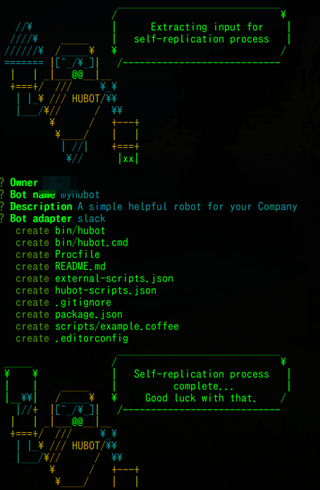

# hubot
slackでbotを作ってみる。

開発には以下６つのモジュールが必要らしい。
* Node.js
* npm
* hubot
* yo
* generator-hubot
* coffee-script -->いらないかも。

## 導入手順
### Node.js, npmのインストール
まず`apt-get`でnodejsとnpmをインストールします。
```
$ sudo apt-get install -y nodejs npm
```
次にn packageを導入
```
$ sudo npm cache clean
$ sudo npm install n -g
```
最後にn packageを使ってnodeをインストールします。
```
$ sudo n stable
$ sudo ln -sf /usr/local/bin/node /usr/bin/node
```
バージョンの確認
```
$ node -v
v6.2.1
```
最初に入れたnodejsとnpmは古いので削除します。
```
$ sudo apt-get purge -y nodejs npm
```
### yo, generator-hubotのインストール
続いてnpmでYeoman(yo)とYeomanジェネレータ(generator-hubot)
をインストールします。
```
$ sudo npm install -g yo generator-hubot
```

## bot生成
さて、待ちに待ったbotの生成です。  
bot名のディレクトリを作って、そこで`yo hubot`を実行します。
```
$ mkdir myhubot
$ cd myhubot
$ yo hubot
```


## botを動かす
以下のコマンドで起動します。
```
$ bin/hubot
```
次のコマンドで返事が返ってくるか確認しましょう。
```
<bot名>> <bot名> ping
<bot名>> PONG
```
返ってくればひとまず成功です。
